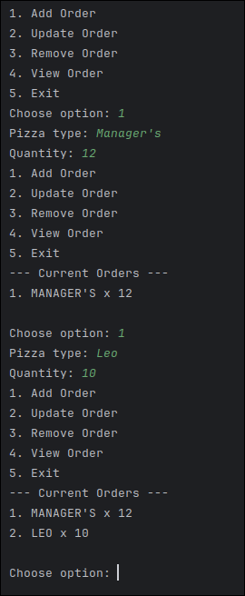
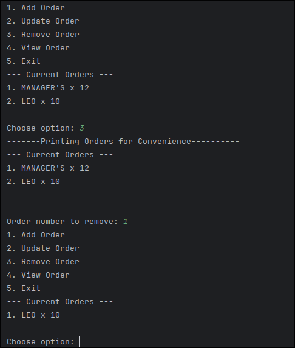
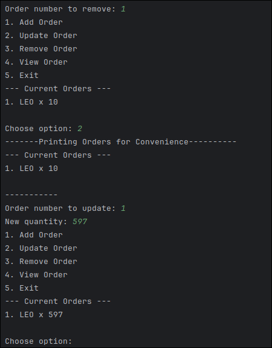
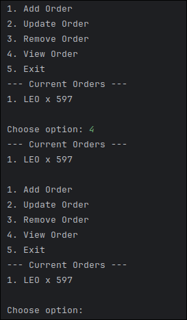
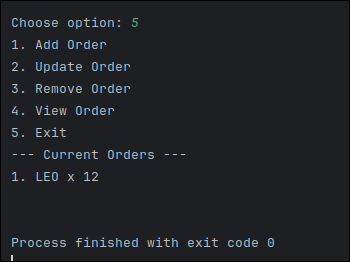
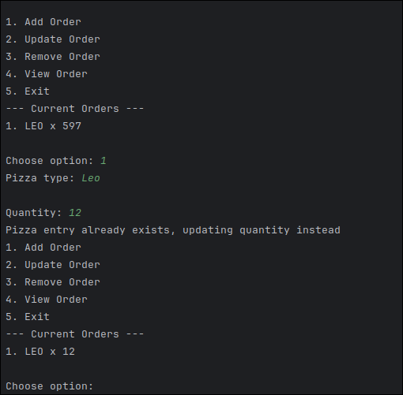

# Lab 6: Ordering System
## Author: Nicholo Pardines

## Adding an Order

## Deleting an Order

## Updating an Order

## Viewing Order List

- Note: I already use `printMenu()` in the while condition
## Exiting

## Extra Functinality, (Adding if it already exists in-memory)

- Able to update using add if there's already an existing match.